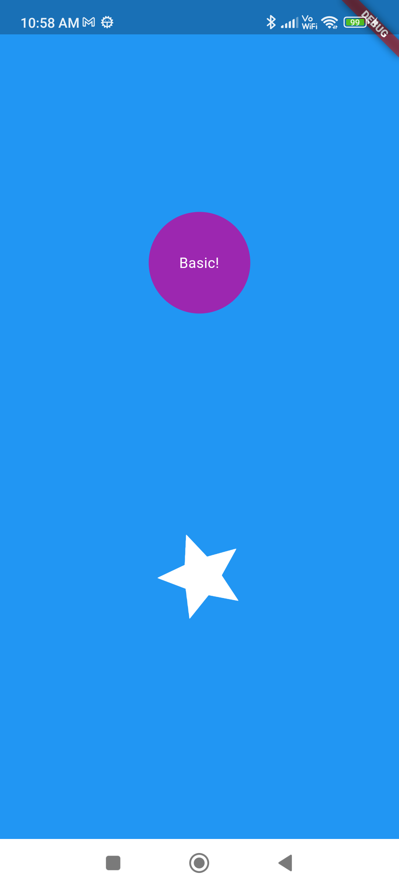

# Animation

This Flutter project demonstrates the usage of `AnimatedContainer`, `Tween`, and `AnimationController` to create dynamic and visually appealing animations.

## Project Overview

The **Animation** project showcases various animations implemented using Flutter. It serves as a helpful resource for understanding and exploring the capabilities of `AnimatedContainer`, `Tween`, and `AnimationController` in Flutter applications.

## Features

- AnimatedContainer: Demonstrates how to animate container properties such as size, color, and shape using `AnimatedContainer`.
- Tween: Shows how to interpolate between different values using `Tween` to create smooth transitions.
- AnimationController: Utilizes `AnimationController` to control the duration, speed, and state of the animations.</br>
 </br>


## Getting Started

To get started with the **Animation** project, follow these steps:

### Prerequisites

- Flutter SDK: Make sure you have Flutter SDK installed on your machine. For installation instructions, refer to the official [Flutter documentation](https://flutter.dev/docs/get-started/install).

### Installation

1. Clone the repository:

   ```
   git clone https://github.com/Suraj820/animation.git
   ```

2. Change to the project directory:

   ```
   cd animation
   ```

3. Install the dependencies:

   ```
   flutter pub get
   ```

### Running the App

Use the following command to run the Flutter app on a connected device or simulator:

```
flutter run
```

## Contributing

Contributions are welcome! If you want to contribute to this project, please follow these steps:

1. Fork this repository.
2. Create a new branch for your feature or bug fix.
3. Make your changes and commit them.
4. Push your changes to your fork.
5. Submit a pull request.

Please ensure that your pull request follows the [contribution guidelines](CONTRIBUTING.md).

## License

The **Animation** project is available under the [MIT License](LICENSE). Feel free to modify and use the code according to your needs.

## Acknowledgements

This project was inspired by the Flutter framework and the community of Flutter developers who continuously strive to create amazing user experiences through animations.

## Contact

If you have any questions or suggestions regarding the **Animation** project, feel free to reach out to the author:

- Author: Suraj Pal
- GitHub: [Suraj820](https://github.com/Suraj820)
